<style>
  .l-text {
    font-size: 40px;
  }
  .m-text{
    font-size: 30px;
  }
  .s-text {
    font-size: 25px;
  }
  .name-text {
    font-size: 20px;
  }
  .custom-button {
    background-color: black;  /* 设置背景颜色为黑色 */
    color: white;  /* 设置文字颜色为白色，确保可读性 */
    padding:5px 20px;  /* 可选：设置内边距 */
    border-radius: 20px;  /* 可选：设置圆角 */
    text-decoration: none;  /* 去掉链接的下划线 */
    display: inline-flex;
    align-items: center;
    justify-content: center;
  }
  p {
        margin-top: 40px;   /* 设置段落顶部的间距 */
        margin-bottom: 20px; /* 设置段落底部的间距 */
        text-align: center;
    }

.custom-button i {
    margin-right: 8px;  /* 可选：给图标和文本之间添加间距 */
  }
</style>
<link rel="stylesheet" href="https://cdnjs.cloudflare.com/ajax/libs/font-awesome/5.15.4/css/all.min.css">

<center>
<span class="l-text">
<b>
Data Center Cooling System Optimization <br>
Using Offline Reinforcement Learning
</b>
</span>
<br><br>
<span class="name-text">
<a href="https://zhanxianyuan.xyz/" target="_blank">Xianyuan Zhan<sup>1,2∗†</sup></a>, <a href="https://air-dream.netlify.app/author/xiangyu-zhu/" target="_blank">Xiangyu Zhu<sup>1∗</sup></a>, Peng Cheng<sup>1</sup>, Xiao Hu<sup>1</sup>, Ziteng He<sup>1</sup>, Hanfei Geng<sup>1</sup>, Jichao Leng<sup>1</sup>, Huiwen Zheng<sup>3</sup>, Chenhui Liu<sup>3</sup>, Tianshun Hong<sup>3</sup>, Yan Liang<sup>3</sup>, Yunxin Liu<sup>1,2†</sup>, Feng Zhao<sup>1†</sup>
<br><br>
<sup>1</sup> Institute for AI Industry Research, Tsinghua University
<br>
<sup>2</sup> Shanghai Artificial Intelligence Laboratory 
<br>
<sup>3</sup> Global Data Solutions Co., Ltd.
<br><br>
{zhanxianyuan, liuyunxin}@air.tsinghua.edu.cn, fz@alum.mit.edu 
<br><br>
<b>Publication:</b> The Thirteenth International Conference on Learning Representations (ICLR 2025) 
<br>
<!-- <a href="https://arxiv.org/html/2501.15085v1">📄 论文链接</a> -->
<a href="https://arxiv.org/html/2501.15085v1" class="external-link button is-normal is-rounded custom-button" target="_blank">
    <i class="fas fa-file-pdf"></i> arXiv
</a>
</span>
</center>

<br><br>

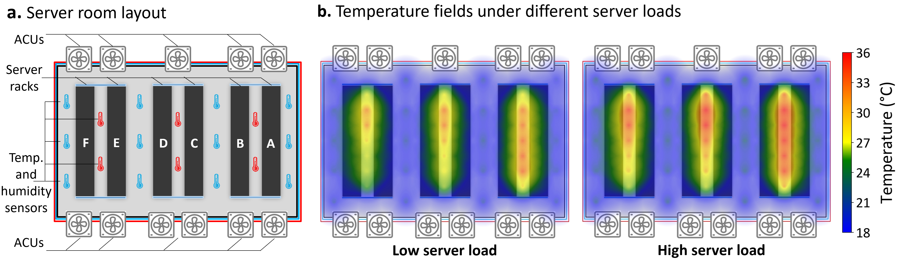
<center>
The challenges in DC cooling system optimization: 1) frequently changing sever loads and physical locations of servers produce complex and dynamic temperature fields inside the server room; 2) commercial DCs have very strict thermal safety and operational requirements; 3) exceptionally hard to build high-fidelity and scalable simulators; 4) the historical operational data from real-world DC cooling systems are limited, and the data coverage is also quite narrow.
</center>

<br><br>

<center>
<span class="m-text">
<b>Abstract</b>
</span>
</center>
<br>

The recent advances in information technology and artificial intelligence have fueled a rapid expansion of the data center (DC) industry worldwide, accompanied by an immense appetite for electricity to power the DCs. In a typical DC, around 30-40% of the energy is spent on the cooling system rather than on computer servers, posing a pressing need for developing new energy-saving optimization technologies for DC cooling systems. However, optimizing such real-world industrial systems faces numerous challenges, including but not limited to a lack of reliable simulation environments, limited historical data, and stringent safety and control robustness requirements. In this work, we present a novel physics-informed offline reinforcement learning (RL) framework for energy efficiency optimization of DC cooling systems. The proposed framework models the complex dynamical patterns and physical dependencies inside a server room using a purposely designed graph neural network architecture that is compliant with the fundamental time-reversal symmetry. Because of its well-behaved and generalizable state-action representations, the model enables sample-efficient and robust latent space offline policy learning using limited real-world operational data. Our framework has been successfully **deployed and verified** in a large-scale production DC for closed-loop control of its air-cooling units (ACUs). We conducted a total of **2000 hours** of short and long-term experiments in the production DC environment. The results show that our method achieves **14-21%** energy savings in the DC cooling system, without any violation of the safety or operational constraints. We have also conducted a comprehensive evaluation of our approach in a real-world DC testbed environment. Our results have demonstrated the significant potential of offline RL in solving a broad range of data-limited, safety-critical real-world industrial control problems.

<br><br>

<center>
<span class="m-text">
<b>Method</b>
</span>
</center>
<!-- <br><br> -->
<p>
<span class="s-text">
The physics-informed offline RL framework for energy-efficient DC cooling control
</span>
</p>

- A safety-aware reward function to balance energy saving and temperature regulation;
- A special T-symmetry enforced thermal dynamics model (TTDM) to model and explain the fundamental thermal dynamics patterns inside the server room;
- A highly sample-efficient offline RL algorithm for energy-efficient DC cooling control by integrating the properties of the learned TTDM.

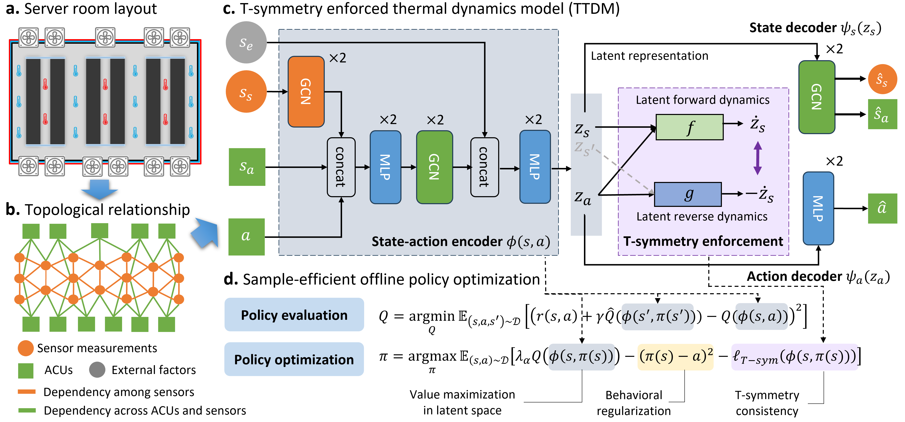

<br><br>

<center>
<span class="m-text">
<b>
Experimental Results
</b>
</span>
</center>
<!-- <br><br> -->

<p>
<span class="s-text">
Significant energy efficiency improvement
</span>
</p>

Comparison of conventional PID control and our approach under comparable server load settings on two server rooms of the commercial DC. “AEP” and “EC” denote average electric power and energy consumption, respectively. We use the offline RL policy to control 4, 6, and all the ACUs in each room. ACLF is the air-side cooling load factor, calculated as the ratio of energy consumption of ACUs to servers, the lower the better.
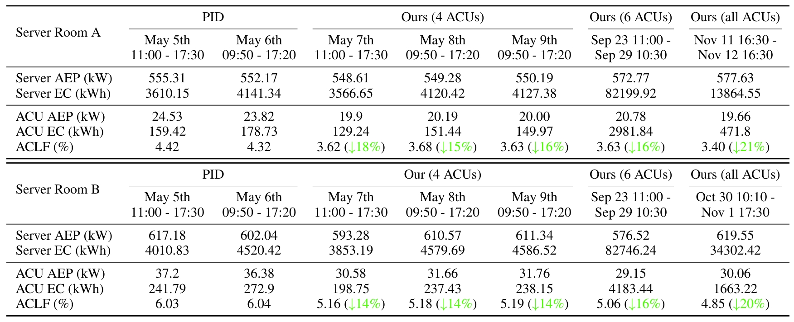

<!-- <br><br> -->

<p>
<span class="s-text">
Control quality
</span>
</p>

We conducted two 24-hour experiments in the production DC environment to compare the temperature field distribution under the PID controller and our method. The tow videos below shows the visualization of temperature field changes during the two experiments. The temperature field distribution under the control of our model is more uniform and fluctuates less.

<div style="display: flex; justify-content: space-between; gap: 15px;">
    <div style="text-align: center;">
        <h3 style="font-size: 12px; color: blue">PID Controller<br>2024-05-14 00:00 – 24:00</h3>
        <video width="100%" autoplay controls loop playsinline muted>
            <source src="./doc/pid_401_0514_x3.mp4" type="video/mp4">
        </video>
    </div>
    <div style="text-align: center; color: green">
        <h3 style="font-size: 12px;">Ours<br>2024-06-30 00:00 – 24:00</h3>
        <video width="100%" autoplay controls loop playsinline muted>
            <source src="./doc/ai_401_0630_x3.mp4" type="video/mp4">
        </video>
    </div>
</div>

<br><br>

We conducted consecutive 48-hour experiments to compare the control behaviors of our method and the PID controllers in Server Room B with fluctuating server loads.

- The total server load fluctuated at a similar level, but our method consistently achieved noticeably lower ACLF value than that of the PID controller, indicating higher energy efficiency;
- Our method tends to lower the fan speeds while slightly increasing the cold water valve openings, which helps reduce ACU energy consumption while maintaining the same level of cooling capacity.
- Our method achieves significantly better temperature regulation for the hot aisle, indicating a more uniform and stable temperature field inside the hot aisle (HAT, hot aisle temperature).

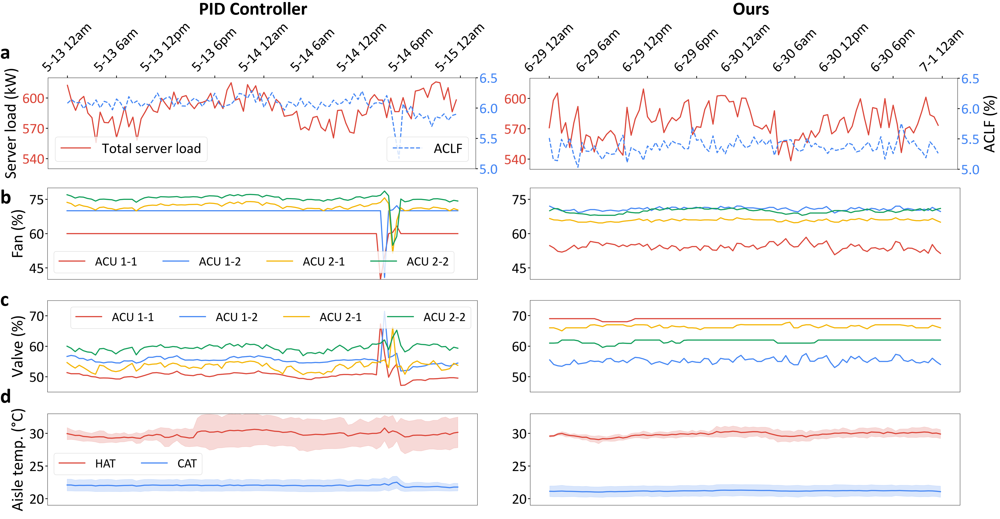
<center>
Comparisons of key system metrics and the controllable actions of our method and the PID controller over 2-day testing periods in Server Room B. Figures on the left show results from the PID-controlled period (May 13-15, 2024), and figures on the right are the results controlled by our method (June 29- July 1, 2024).
</center>

<!-- <br><br> -->

<p>
<span class="s-text">
Long-term control performance
</span>
</p>

To verify the long-term robustness and energy-saving effectiveness of our method, we conducted two 14-day experiments by continuously running our offline RL policy and the PID controller on the 4 controllable ACUs in Server Room B.

- The ACLF values of our model are consistently lower than those of the PID controller across all server load conditions, with even lower ACLF values observed under higher server loads. 
- Our model leaded to a more uniform temperature field inside the hot aisle during the testing period.
- The potential of our method for safe and stable long-term deployment in real-world data centers.

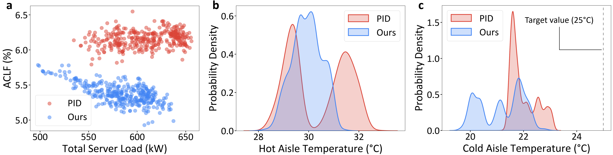

<center>
Results of the 14-day long-term experiments in Server Room B. <b>a</b>, ACLF values under different total server loads. <b>b, c,</b> Temperature distribution of the directly influenced hot and cold aisles.
</center>

<!-- <br><br> -->

<p>
<span class="s-text">
Impact of the number of controlled ACUs
</span>
</p>

We also conducted additional experiments with our model controlling 1 to all ACUs to further investigate its energy-saving impact. **a** shows the experiment results conducted in seven morning periods (10:30- 13:30) in Server Room A; **b,c** on the right show the experiment results conducted in seven morning (10:30- 13:30) and afternoon (14:30- 17:30) periods in Server Room B. These promising results suggest that if more ACUs can be controlled by our method, it is very likely that we can achieve even higher energy efficiency.

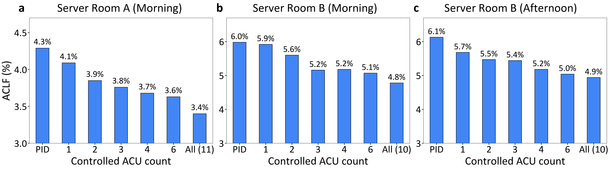

<center>
The energy-saving impact of controlling different numbers of ACUs through our approach.
</center>

<!-- <br><br> -->

<p>
<span class="s-text">
Good adaptability under drastic server load fluctuation
</span>
</p>

To further evaluate the adaptability and load-awareness of our method, we tested on a specific scenario with drastic server load fluctuations in Server Room B. The PID controller demonstrates limited adaptability in this scenario, with no adjustments to fan speeds and only marginal changes in valve opening percentage. In contrast, our offline RL approach was able to promptly adapt to external changes, resulting in a more optimal and energy-efficient strategy. These results underscore the effectiveness and adaptability of our approach in highly dynamic DC service conditions. 

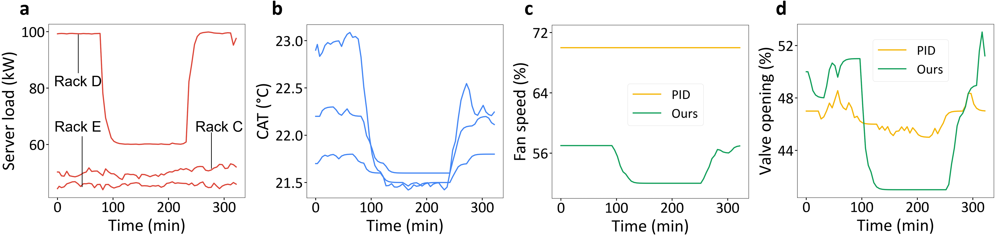

<center>
ACU control behaviors of our method and the PID controller under drastic server load fluctuation.  <b>a,</b> Load variation pattern of three server racks (Rack C, D, E) during the selected time period, with one server rack having a drastic load drop and increase. <b>b,</b> Temperature readings from the three most relevant cold aisle sensors.<b>c, d,</b> The variations in fan speed and valve opening for two ACUs during the time period, with one controlled by the PID controller (ACU 1-1) and the other by our method (ACU 1-2).
</center>

<!-- <br><br> -->

<p>
<span class="s-text">
Comparative evaluation against baseline methods
</span>
</p>

As testing in the production DC environment suffers lots of restrictions, to further validate our method, we conducted extensive exploratory experiments and model ablations in our testbed environment.

We compare our method with competing baseline methods including conventional industrial control methods PID and MPC, off-policy RL-based DC cooling optimization method CCA, mainstream offline RL algorithms IQL and CQL, and the state-of-the-art safe offline RL algorithm FISOR. Some aggressive baseline methods (CCA and CQL) achieve lower energy consumption but perform poorly in terms of thermal safety, which is unacceptable. By contrast, our method achieved the highest energy efficiency under all load conditions, while ensuring no CAT violations throughout the experiments, outperforming all other baseline methods. 

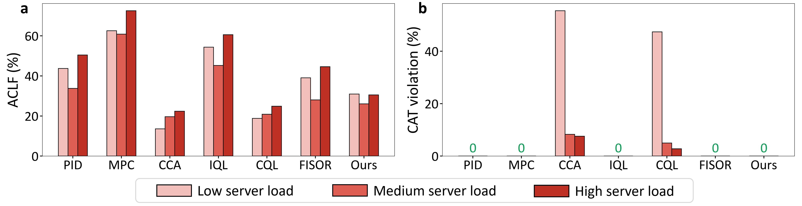

<center>
Comparative evaluation of our method against baseline methods on our real-world testbed.
</center>

<br><br>

<center>
<span class="m-text">
<b>
System deployment in real-world
</b>
</span>
</center>

<!-- <br><br> -->

<p>
<span class="s-text">
Overall architecture of the deployment system
</span>
</p>

We have developed a full-function software system to facilitate the deployment and validation of our proposed physics-informed offline RL framework. The overall deployed system architecture is illustrated as below, which consists of two main phases: **offline training** and **online deployment**.

<!-- 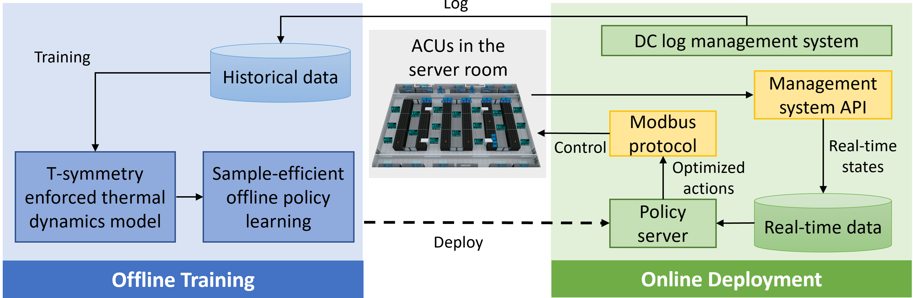 -->
<div style="text-align: center;">
  
</div>

- **Offline training**: the historical operational data of the floor-level cooling systems is exported from the DC log management system. The exported data undergoes automated data processing and feature engineering processes and is stored in a historical dataset. Then we train the T-symmetry enforced thermal dynamics model, followed by a sample-efficient offline policy learning module to obtain the optimized floor-level cooling control policy. 
- **Online deployment**:  the learned policy is deployed in a local policy server within the data center to provide control services. Real-time data from the cooling systems is retrieved by the management system API, processed, and stored in a real-time database. The system then forwards the real-time data to the policy server, which outputs optimized ACU control actions. These optimized control actions are directly written into the ACUs via the Modbus protocol for closed-loop control.

<!-- <br><br> -->

<p>
<span class="s-text">
Real-world testing environments
</span>
</p>

- **Production data center envirnment**

<!-- 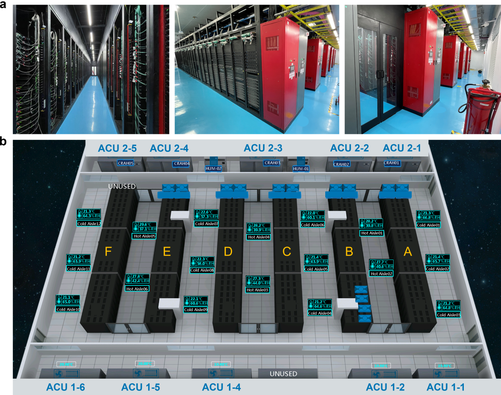 -->
<div style="text-align: center;">
  
</div>

<center>
<b>a,</b> Photographs of the interior of a server room, showcasing the hot aisle, cold aisle, and server racks from left to right. <b>b,</b> Overhead panoramic view of a server room, illustrating the spatial arrangement of all pertinent equipment.
</center>

<br><br>

- **Real-world testbed**

> To thoroughly assess the performance of our proposed method, we also constructed a real-world testbed environment, which contains 22 servers and an inter-column air conditioner as the ACU (located between Rack 1 and Rack 2).  This is a compressor-based ACU, which is smaller than the typical ACUs in commercial data centers that use the cold water from chillers and cooling towers as the cold source. 

<!-- 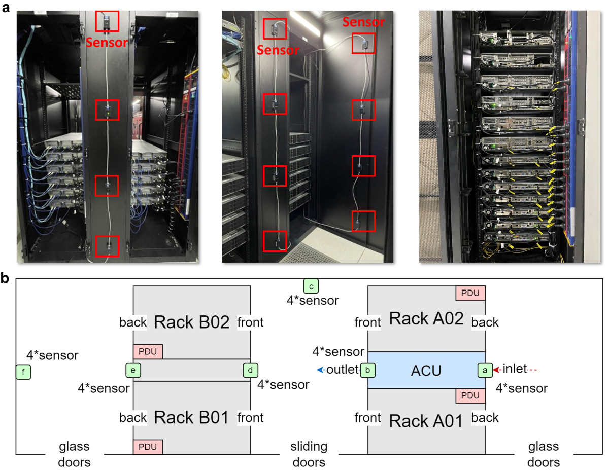 -->
<div style="text-align: center;">
  
</div>

<center>
<b>a</b>, Illustration of the installed temperature and humidity sensors in our testbed. <b>b,</b> Layout illustration of the testbed.
</center>

<!-- <br><br> -->

<p>
<span class="s-text">
Historical dataset distributions
</span>
</p>

Below shows the historical dataset distributions collected from our real-world testbed, in which we collect system operational data from more diverse server load and control settings, resulting in relatively broader state-action space coverage than that of the production DCs. 

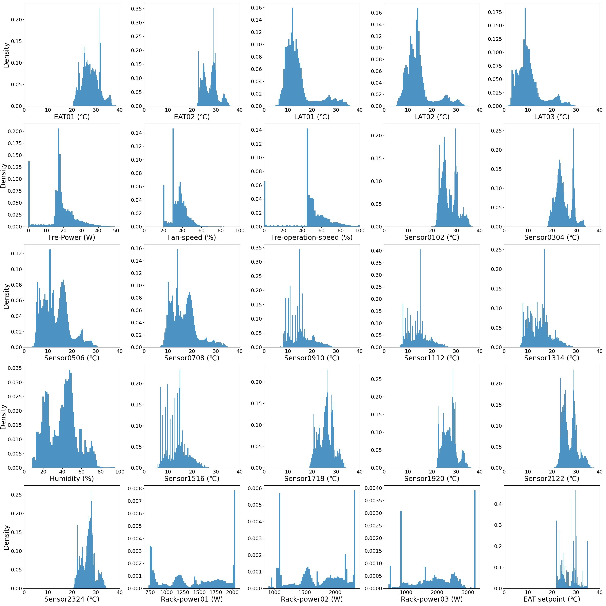

<center>
Distributions of the state and action features in our historical dataset collected from the real-world DC testbed.
</center>

<br><br>

<center>
<span class="m-text">
<b>
Citation (BibTeX)
</b>
</span>
</center>

```
@inproceedings{
zhan2025data,
title={Data Center Cooling System Optimization Using Offline Reinforcement Learning},
author={Xianyuan Zhan, Xiangyu Zhu, Peng Cheng, Xiao Hu, Ziteng He, Hanfei Geng,
Jichao Leng, Huiwen Zheng, Chenhui Liu, Tianshun Hong, Yan Liang, Yunxin Liu, Feng Zhao},
booktitle={The Thirteenth International Conference on Learning Representations},
year={2025},
url={https://arxiv.org/html/2501.15085v1}
}
```
